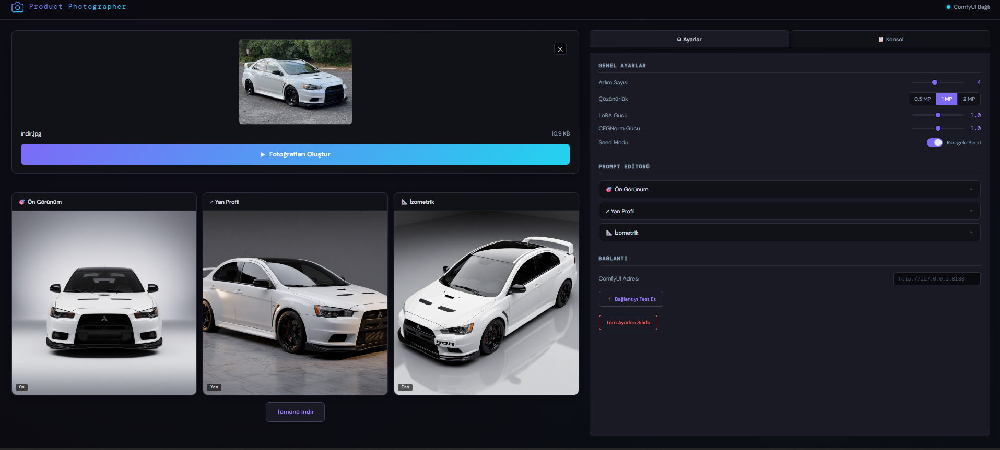

# 🖼️ Product Photo AI — Yapay Zeka Destekli Ürün Görsel Üretim Sistemi

<div align="center">



**E-ticaret ürün fotoğraflarını yapay zeka ile profesyonel stüdyo görsellerine dönüştüren yerel (offline) masaüstü uygulaması.**

[](https://react.dev/)
[](https://vitejs.dev/)
[](https://github.com/comfyanonymous/ComfyUI)
[](https://huggingface.co/Comfy-Org/Qwen-Image-Edit_ComfyUI)

</div>

---

## 📋 İçindekiler

- [Proje Hakkında](#-proje-hakkında)
- [Özellikler](#-özellikler)
- [Sistem Mimarisi](#-sistem-mimarisi)
- [Teknolojiler](#-teknolojiler)
- [Gereksinimler](#-gereksinimler)
- [Kurulum](#-kurulum)
- [Kullanım](#-kullanım)
- [Proje Yapısı](#-proje-yapısı)
- [Performans](#-performans)
- [Ekip](#-ekip)
- [Lisans](#-lisans)

---

## 🎯 Proje Hakkında

E-ticaret ekosisteminde ürün görsellerinin kalitesi, satış başarısını belirleyen en kritik faktörlerden biridir. Profesyonel ürün fotoğrafçılığı ise küçük ve orta ölçekli satıcılar için ciddi maliyet ve zaman engeli oluşturmaktadır.

**Product Photo AI**, satıcının akıllı telefonuyla çektiği sıradan bir ürün fotoğrafını sisteme yüklemesiyle, **3 farklı profesyonel kamera açısından** (ön görünüm, yan profil, izometrik görünüm) stüdyo kalitesinde görseller üretir.

> 🔒 Tüm işlemler tamamen **yerel donanımda** gerçekleşir — hiçbir görsel harici sunuculara gönderilmez.

### Proje Geçmişi

Proje iki evrede ilerlemiştir:

1. **İlk Evre — Stable Diffusion 1.5:** Geleneksel diffusion yaklaşımıyla kapsamlı deneyler gerçekleştirilmiş; donanım sınırlılıkları ve model kısıtları (görsel kimlik koruma yetersizliği, denoise-kalite ikilemi) nedeniyle yeterli sonuç alınamamıştır.

2. **İkinci Evre — Qwen Image Edit:** Alibaba'nın geliştirdiği Qwen Image Edit modeli benimsenmiş; görsel-dil anlama kabiliyeti, Lightning LoRA hız optimizasyonu ve ComfyUI altyapısıyla birleştirilerek başarılı sonuçlar elde edilmiştir.

---

## ✨ Özellikler

| Özellik | Açıklama |
|---------|----------|
| 🎨 **3 Farklı Açı** | Ön görünüm, yan profil ve izometrik perspektiften otomatik üretim |
| 🧠 **Görsel Kimlik Sadakati** | Ürünün rengi, şekli, dokusu ve logosu korunarak çevre yeniden yaratılır |
| ⚡ **Lightning LoRA** | 4 adımda hızlı üretim — 20-60 saniye (sıcak başlatma) |
| 🖥️ **Tamamen Yerel** | Bulut servisi veya ücretli API kullanılmaz |
| 🔧 **Özelleştirilebilir** | Megapiksel, prompt ve adım sayısı gibi parametreler ayarlanabilir |
| 📦 **Sürükle-Bırak** | Kolay ürün fotoğrafı yükleme |
| 🔍 **Tam Ekran Önizleme** | Üretilen görsellere tıklayarak tam ekran görüntüleme ve indirme |
| 📊 **İlerleme Takibi** | Gerçek zamanlı ilerleme çubuğu |
| 🔌 **WebSocket İletişimi** | Frontend ile ComfyUI arasında anlık bağlantı |

---

## 🏗️ Sistem Mimarisi

```
┌─────────────────────────────────────────────────────────┐
│                    KULLANICI (Tarayıcı)                  │
│                   http://localhost:5173                   │
└──────────────────────┬──────────────────────────────────┘
                       │  HTTP / WebSocket
                       ▼
┌─────────────────────────────────────────────────────────┐
│               FRONTEND (React + Vite)                    │
│  ┌──────────┐ ┌──────────┐ ┌───────────┐ ┌───────────┐ │
│  │  Image   │ │ Settings │ │  Output   │ │  Progress │ │
│  │ Uploader │ │  Panel   │ │  Gallery  │ │  Section  │ │
│  └──────────┘ └──────────┘ └───────────┘ └───────────┘ │
│  ┌──────────────────┐  ┌──────────────────┐             │
│  │   useComfyUI.js  │  │  useSettings.js  │             │
│  └──────────────────┘  └──────────────────┘             │
└──────────────────────┬──────────────────────────────────┘
                       │  WebSocket (ws://127.0.0.1:8188)
                       ▼
┌─────────────────────────────────────────────────────────┐
│                   ComfyUI Backend                        │
│  ┌──────────────────────────────────────────────┐       │
│  │          Qwen Image Edit Pipeline             │       │
│  │  ┌──────┐  ┌───────────┐  ┌─────┐  ┌──────┐ │       │
│  │  │ UNET │  │Text Encode│  │ VAE │  │ LoRA │ │       │
│  │  └──────┘  └───────────┘  └─────┘  └──────┘ │       │
│  └──────────────────────────────────────────────┘       │
└─────────────────────────────────────────────────────────┘
```

---

## 🛠️ Teknolojiler

### Frontend
- **React 18.3** — UI bileşen mimarisi
- **Vite 5.4** — Geliştirme sunucusu ve bundler
- **Vanilla CSS** — Özelleştirilmiş stil sistemi

### Backend (AI Engine)
- **ComfyUI Portable** — Görsel üretim pipeline yöneticisi
- **Qwen Image Edit 2509** — Ana diffusion modeli (görsel-dil mimarisi)
- **Qwen 2.5 VL 7B** — CLIP text encoder
- **Lightning LoRA** — 4 adımlı hız optimizasyonu

### İletişim
- **WebSocket** — Frontend ↔ ComfyUI gerçek zamanlı bağlantı

---

## 📌 Gereksinimler

| Gereksinim | Minimum |
|------------|---------|
| **İşletim Sistemi** | Windows 10/11 |
| **GPU** | NVIDIA (6GB+ VRAM) |
| **RAM** | 16GB (24GB önerilir) |
| **Disk Alanı** | ~10GB (model dosyaları) |
| **Node.js** | v18+ |
| **Tarayıcı** | Chromium tabanlı (Chrome, Edge) |

---

## 🚀 Kurulum

### Adım 1: Repoyu Klonlayın

```bash
git clone https://github.com/<kullanici-adi>/product-photo-ai.git
cd product-photo-ai
```

### Adım 2: ComfyUI Kurulumu

`ComfyUI_windows_portable.rar` dosyasını proje dizinine çıkartın.

### Adım 3: AI Model Dosyalarını İndirin

Aşağıdaki model dosyalarını indirip belirtilen klasörlere yerleştirin:

<details>
<summary><strong>📥 UNET — Ana Diffusion Modeli (~4-5 GB)</strong></summary>

- **Dosya:** `qwen_image_edit_2509_fp8_e4m3fn.safetensors`
- **Link:** [HuggingFace'den İndir](https://huggingface.co/Comfy-Org/Qwen-Image-Edit_ComfyUI/resolve/main/split_files/diffusion_models/qwen_image_edit_2509_fp8_e4m3fn.safetensors)
- **Hedef Klasör:** `ComfyUI/models/unet/`

</details>

<details>
<summary><strong>📥 Text Encoder — CLIP Dil Modeli (~4 GB)</strong></summary>

- **Dosya:** `qwen_2.5_vl_7b_fp8_scaled.safetensors`
- **Link:** [HuggingFace'den İndir](https://huggingface.co/Comfy-Org/Qwen-Image_ComfyUI/resolve/main/split_files/text_encoders/qwen_2.5_vl_7b_fp8_scaled.safetensors)
- **Hedef Klasör:** `ComfyUI/models/text_encoders/`

</details>

<details>
<summary><strong>📥 VAE — Görüntü Kodlayıcı/Çözücü (birkaç yüz MB)</strong></summary>

- **Dosya:** `qwen_image_vae.safetensors`
- **Link:** [HuggingFace'den İndir](https://huggingface.co/Comfy-Org/Qwen-Image_ComfyUI/resolve/main/split_files/vae/qwen_image_vae.safetensors)
- **Hedef Klasör:** `ComfyUI/models/vae/`

</details>

<details>
<summary><strong>📥 LoRA — Lightning Hız Adaptörü (birkaç yüz MB)</strong></summary>

- **Dosya:** `Qwen-Image-Edit-2509-Lightning-4steps-V1.0-bf16.safetensors`
- **Link:** [HuggingFace'den İndir](https://huggingface.co/lightx2v/Qwen-Image-Lightning/resolve/main/Qwen-Image-Edit-2509/Qwen-Image-Edit-2509-Lightning-4steps-V1.0-bf16.safetensors)
- **Hedef Klasör:** `ComfyUI/models/loras/`

</details>

### Adım 4: Frontend Bağımlılıklarını Yükleyin

```bash
cd frontend
npm install
```

---

## 💻 Kullanım

### 1. ComfyUI Motorunu Başlatın

```bash
# ComfyUI klasöründeki bat dosyasını çalıştırın
ComfyUI/run_nvidia_gpu.bat
```

> ⏳ İlk yükleme 1-2 dakika sürebilir. Terminalde `"To see the GUI go to: http://127.0.0.1:8188"` mesajını gördüğünüzde motor hazırdır.

### 2. Frontend'i Başlatın

```bash
cd frontend
npm run dev
```

### 3. Uygulamayı Açın

Tarayıcınızda **[http://localhost:5173](http://localhost:5173)** adresine gidin.

### 4. Görsel Üretin

1. 📸 Ürün fotoğrafını **sürükle-bırak** veya tıklayarak yükleyin
2. ⚙️ *(İsteğe bağlı)* Ayarlar panelinden parametreleri düzenleyin
3. 🚀 **"Fotoğrafları Oluştur"** butonuna basın
4. ⏳ 3 farklı açıdan üretilen görsellerin tamamlanmasını bekleyin
5. 🖼️ Hazır görsellere tıklayarak tam ekran görüntüleyin veya indirin

---

## 📁 Proje Yapısı

```
product-photo-ai/
├── ComfyUI/                          # AI motoru (ComfyUI Portable)
│   ├── ComfyUI/                      # Ana ComfyUI dizini
│   │   └── models/
│   │       ├── unet/                 # Diffusion modeli
│   │       ├── text_encoders/        # CLIP text encoder
│   │       ├── vae/                  # VAE modeli
│   │       └── loras/                # Lightning LoRA
│   ├── run_nvidia_gpu.bat            # GPU ile başlatma
│   └── run_cpu.bat                   # CPU ile başlatma (yavaş)
│
├── frontend/                         # React uygulaması
│   ├── src/
│   │   ├── components/
│   │   │   ├── Header.jsx            # Üst bar & bağlantı durumu
│   │   │   ├── ImageUploader.jsx     # Sürükle-bırak yükleme
│   │   │   ├── SettingsPanel.jsx     # Parametre ayarları
│   │   │   ├── ProgressSection.jsx   # İlerleme çubuğu
│   │   │   ├── OutputGallery.jsx     # Üretilen görseller galerisi
│   │   │   ├── ConsolePanel.jsx      # Log konsolu
│   │   │   └── Modal.jsx             # Tam ekran önizleme
│   │   ├── hooks/
│   │   │   ├── useComfyUI.js         # ComfyUI WebSocket bağlantısı
│   │   │   └── useSettings.js        # Ayar yönetimi
│   │   ├── App.jsx                   # Ana uygulama bileşeni
│   │   ├── App.css                   # Stil dosyası
│   │   └── main.jsx                  # Giriş noktası
│   ├── package.json
│   └── vite.config.js
│
├── docs/                             # Dokümantasyon dosyaları
│   └── screenshot.png                # Uygulama ekran görüntüsü
│
└── README.md
```

---

## ⚡ Performans

| Durum | Süre |
|-------|------|
| **Soğuk Başlatma** (ilk üretim) | 1-3 dakika |
| **Sıcak Başlatma** (modeller önbellekte) | 20-60 saniye |
| **Çözünürlük 2MP'ye çıkarıldığında** | Belirgin artış |

> 💡 Sürenin büyük bölümü örnekleme sürecine aittir. Görsel yükleme, kodlama ve kaydetme adımları toplam sürenin küçük bir bölümünü oluşturur.

---

## 💪 Güçlü Yönler

- **Görsel Kimlik Sadakati:** Ürünün rengini, şeklini, yüzey dokusunu ve logosunu korur
- **Hız:** Lightning LoRA ile 4 adımda üretim; bulut çözümlerine göre düşük gecikme
- **Esneklik:** Her açı için prompt özelleştirme imkânı
- **Gizlilik:** Hiçbir görsel dış sunuculara gönderilmez

---

## ⚠️ Bilinen Kısıtlar

- NVIDIA GPU (6GB+ VRAM) gereksinimi
- Karmaşık şekilli, şeffaf veya yansıtıcı ürünlerde zaman zaman kimlik koruma güçlüğü
- Tek seferde bir ürün işlenebilir (toplu işleme henüz desteklenmemektedir)

---

## 👥 Ekip

Bu proje, İstanbul Üniversitesi-Cerrahpaşa Bilgisayar Mühendisliği Bölümü **Yapay Zekaya Giriş** dersi kapsamında geliştirilmiştir.

| İsim | Rol |
|------|-----|
| **Enes ÇAKMAK** | Geliştirici |
| **Furkan Talha KASIM** | Geliştirici |
| **Mustafa TETİK** | Geliştirici |
| **Nail KOCABAY** | Geliştirici |

**Danışman:** Prof. Dr. Kazım YILDIZ & Araştırma Görevlisi Merve PINAR

---

## 📚 Kaynakça

- Lin, J., et al. (2025). *Sell It Before You Make It: Diffusion-Based Product Image Generation for E-Commerce.* Alibaba Research.
- Rombach, R., et al. (2022). *High-Resolution Image Synthesis with Latent Diffusion Models.* CVPR 2022.
- Ho, J., et al. (2020). *Denoising Diffusion Probabilistic Models.* NeurIPS 2020.
- Hu, E. J., et al. (2021). *LoRA: Low-Rank Adaptation of Large Language Models.* arXiv:2106.09685.
- Qwen Team, Alibaba. (2025). *Qwen2.5-VL Technical Report.* arXiv.
- [ComfyUI GitHub Repository](https://github.com/comfyanonymous/ComfyUI)

---

## 📄 Lisans

Bu proje akademik amaçlarla geliştirilmiştir. Daha fazla bilgi için proje ekibiyle iletişime geçin.

---

<div align="center">

**İstanbul, 2026**

</div>
